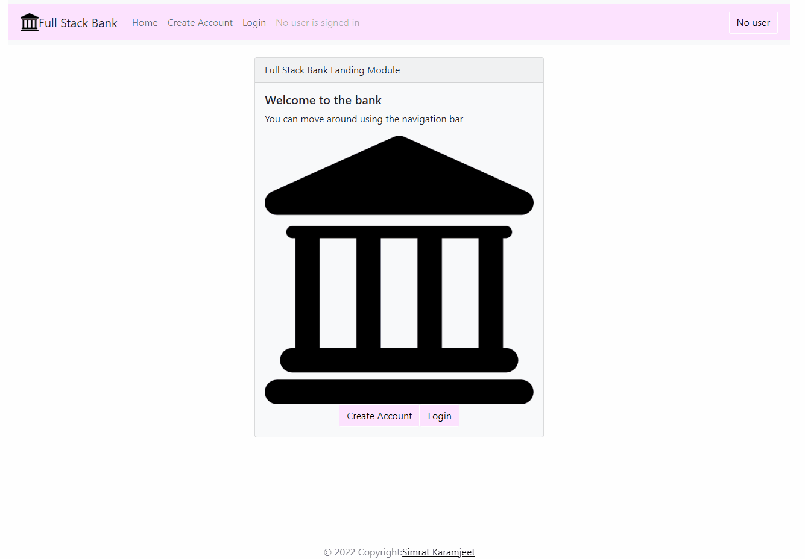

# CapstoneProject

This is a somewhat secured banking app created with the MERN stack and deployed on Heroku

## Description
This project was created as a part of MIT xPRO Professional Certificate in Coding program.  

## Installation Guidelines
1 - Clone the repo to your git desktop
2 - Install Node.js
3 - Run 'npm install' in the project folder
4 - Create a MongoDB Atlas database and use the uri in dal.js line 3.
5 - Run 'node index.js' in the terminal at the root of the project folder
6 - Browse to http://localhost:3000 in a chrome/mozilla browser

## Deployed on Heroku
[Link](https://simratkaramjeetbankingapp.herokuapp.com/)

## App

## Tech stack
MongoDB, Express, Reactjs, Nodejs, Heroku dyno, HTML, CSS, Javascript

## Features
Lets you create an account, login, deposit, withdraw, view balance, logout and see all activity.  There is some authentication of user with Firebase but still working on authorization

## License
[MIT License](LICENSE)
